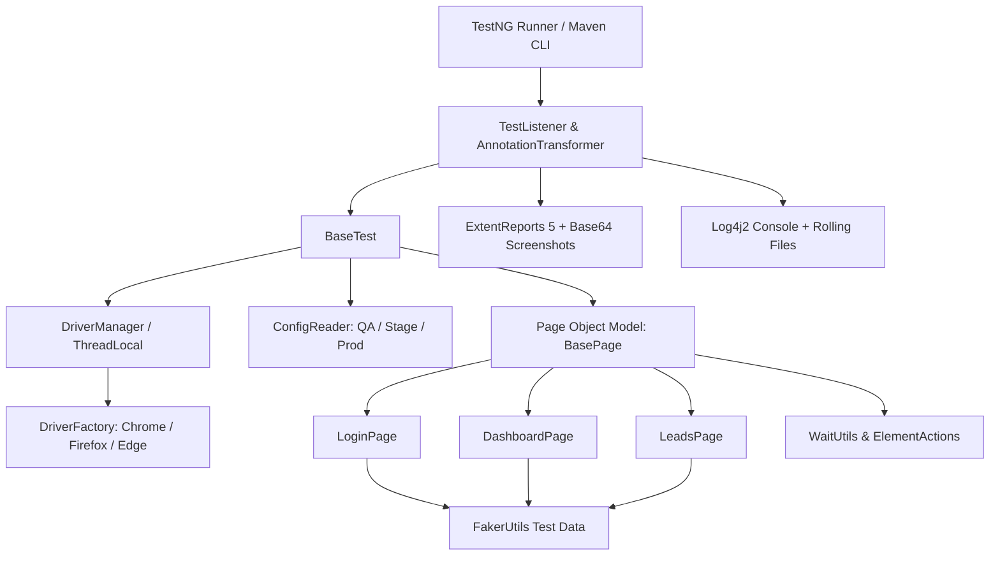

# Enterprise Selenium 4 + Java + TestNG Automation Framework


A production-grade, enterprise-level test automation framework designed following senior SDET industry standards and the **RICE-POT Prompt Engineering methodology**. Built specifically for complex web ecosystems (such as Enterprise CRM platforms like Salesforce, HubSpot, and ServiceNow).

---

## Architectural Highlights

- **Thread-Safe Concurrency**: Strict browser isolation using `ThreadLocal<WebDriver>` enabling multi-threaded parallel execution across classes, methods, and browsers without collision.
- **Fluent Page Object Model (POM)**: High-cohesion, loosely-coupled Page Objects with method chaining for clean, readable test flows.
- **Selenium 4 Native Manager**: Automatic browser driver management for Chrome, Firefox, and Edge with zero third-party binary friction.
- **Dynamic Multi-Environment Support**: Multi-tier configuration files (`config.properties`, `qa-config.properties`, `stage-config.properties`) with runtime CLI overrides.
- **Observability & Visual Reporting**: Integrated **ExtentReports 5** with automatic Base64 screenshot capture on failure, category tags, author tagging, and **Log4j2** colored logs.
- **Smart Failure Resilience**: Automatic test retries for transient failures via TestNG `IRetryAnalyzer` dynamically registered through `IAnnotationTransformer`.
- **Synthetic Data Generation**: In-memory synthetic CRM data generation powered by `DataFaker` (names, emails, phone numbers, companies).



---

## Directory Layout

```text
Selenium_Framework/
├── pom.xml                               # Project dependencies, build profiles, and plugins
├── .gitignore                            # Version control exclusion rules
├── README.md                             # Architectural and operational documentation
├── .github/
│   └── workflows/
│       └── maven-test.yml                # CI/CD GitHub Actions pipeline definition
├── src/
│   ├── main/
│   │   ├── java/com/enterprise/framework/
│   │   │   ├── config/
│   │   │   │   └── ConfigReader.java     # Environment properties loader & CLI resolver
│   │   │   ├── constants/
│   │   │   │   └── FrameworkConstants.java# Framework-wide timeouts, paths, and settings
│   │   │   ├── driver/
│   │   │   │   ├── BrowserType.java      # Supported browser engine enums
│   │   │   │   ├── DriverFactory.java    # Browser options & driver instantiator
│   │   │   │   └── DriverManager.java    # ThreadLocal<WebDriver> thread-safe storage
│   │   │   ├── pages/
│   │   │   │   ├── BasePage.java         # WebDriver wrapper with waits & actions
│   │   │   │   ├── LoginPage.java        # CRM Authentication Page Object
│   │   │   │   ├── DashboardPage.java    # CRM Navigation & Dashboard Page Object
│   │   │   │   └── LeadsPage.java        # CRM Lead Management Page Object
│   │   │   ├── reports/
│   │   │   │   └── ExtentManager.java    # Thread-safe ExtentReports 5 orchestration
│   │   │   └── utils/
│   │   │       ├── FakerUtils.java       # Dynamic synthetic CRM data generator
│   │   │       ├── Log.java              # Log4j2 logging wrapper
│   │   │       ├── ScreenshotUtils.java  # Base64 & file screenshot utilities
│   │   │       └── WaitUtils.java        # Explicit & fluent synchronization helpers
│   │   └── resources/
│   │       ├── config/
│   │       │   ├── config.properties     # Default global configurations
│   │       │   ├── qa-config.properties  # QA environment endpoints and accounts
│   │       │   └── stage-config.properties# Staging environment configurations
│   │       └── log4j2.xml                # Logging configuration (Console + Files)
│   └── test/
│       ├── java/com/enterprise/framework/
│       │   ├── base/
│       │   │   └── BaseTest.java         # Test lifecycle fixture (@Before/@After)
│       │   ├── listeners/
│       │   │   ├── AnnotationTransformer.java# Dynamic test retry listener attachment
│       │   │   ├── RetryAnalyzer.java    # Flaky test retry logic
│       │   │   └── TestListener.java     # ExtentReports & Log4j2 lifecycle listener
│       │   └── tests/
│       │       ├── LoginTest.java        # Authentication test scenarios
│       │       └── LeadManagementTest.java# End-to-end dynamic CRM lead creation
│       └── resources/
│           ├── testng-smoke.xml          # Smoke test execution suite
│           ├── testng-regression.xml     # Full regression suite runner
│           └── testng-parallel.xml       # Parallel cross-browser execution suite
```

---

## Prerequisites

- **Java Development Kit (JDK)**: Version 17 LTS or higher (compatible up to JDK 25)
- **Apache Maven**: Version 3.8.0 or higher
- **Web Browsers**: Google Chrome, Mozilla Firefox, or Microsoft Edge installed

---

## Execution Guide

### 1. Run Smoke Suite (Default)
```bash
mvn clean test
```

### 2. Run Regression Suite
```bash
mvn clean test -DsuiteXmlFile=src/test/resources/testng-regression.xml
```

### 3. Run Parallel Cross-Browser Suite
```bash
mvn clean test -DsuiteXmlFile=src/test/resources/testng-parallel.xml
```

### 4. Dynamic CLI Parameters
Override browser, environment, and headless execution flags directly from terminal or CI/CD pipelines:

```bash
# Execute in Firefox on Staging Environment
mvn clean test -Dbrowser=firefox -Denv=stage -Dheadless=true

# Execute in Chrome Headless on QA
mvn clean test -Dbrowser=chrome -Denv=qa -Dheadless=true
```

---

## Reporting & Logs

- **ExtentReports HTML**: Saved in `reports/ExecutionReport_<timestamp>.html` with interactive charts, execution metadata, test duration, steps, and embedded Base64 failure screenshots.
- **Application Logs**: Saved under `logs/automation.log` with daily rolling archives (`.log.gz`).
- **Screenshots**: Automatically attached to reports in-memory and saved in `reports/screenshots/` upon assertion failure.

---

## Continuous Integration (GitHub Actions)

A ready-to-use GitHub Actions workflow is provided at [`.github/workflows/maven-test.yml`](.github/workflows/maven-test.yml). It automatically triggers tests on code commits and pull requests, runs headless Chrome in an Ubuntu container, and uploads HTML execution reports as build artifacts for 14-day retention.
