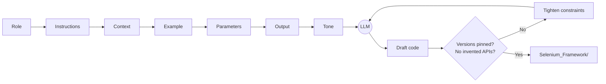
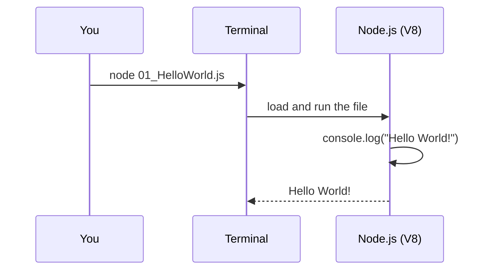
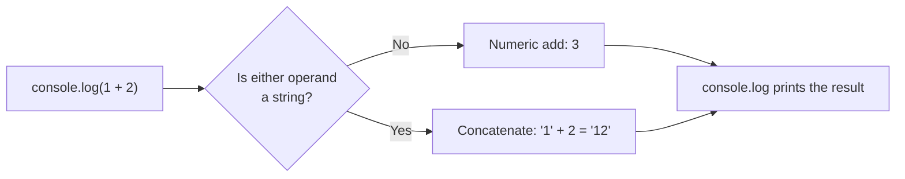

# Learn JavaScript, TypeScript & Playwright


A chapter-by-chapter learning repo for testers moving into JavaScript, TypeScript, and Playwright automation. Every chapter is a folder, every lesson is a small file you can run on its own.

---

## Table of Contents

- [Roadmap](#roadmap)
- [Chapter Summary](#chapter-summary)
- [Project Structure](#project-structure)
- [Getting Started](#getting-started)
- [Chapter 00: Prompt Engineering](#chapter-00-prompt-engineering)
  - [00: RICE-POT Prompt Engineering](#00-rice-pot-prompt-engineering)
- [Chapter 01: JavaScript Basics](#chapter-01-javascript-basics)
  - [01: Hello World](#01-hello-world)
  - [02: Math with Numbers](#02-math-with-numbers)
- [Coming Up](#coming-up)

---

## Roadmap


---

## Chapter Summary

| # | Chapter | Folder | Status | What you learn |
|:--|:--------|:-------|:------:|:---------------|
| 00 | Prompt Engineering | [00_chapter_Prompt_Eng](00_chapter_Prompt_Eng/) | ✅ Done | RICE-POT prompts, anti-hallucination rules, the Selenium framework a prompt generated |
| 01 | JavaScript Basics | [01_chapter_JS_Basics](01_chapter_JS_Basics/) | 🟡 In progress | Running a file with Node, `console.log`, arithmetic expressions |
| 02 | Keywords and Literals | [02_chapter_JS_Keywrods_Literals](02_chapter_JS_Keywrods_Literals/) | ⏳ Planned | Reserved words, literal values |
| 03 | Literals | `03_chapter_JS_Literals` | ⏳ Planned | Number, string, boolean, array and object literals |

---

## Project Structure

```text
LearnJSTSPlaywright4x/
├── README.md
├── .gitignore
├── 00_chapter_Prompt_Eng/
│   ├── 00_RICE_POT_FullForm.md             # What each RICE-POT letter means
│   ├── 01_RICE_POT_Prompt.md               # Worked prompt: Salesforce login (Selenium + TestNG)
│   ├── 02_Problem_Statement.md             # The objective the prompt solves
│   ├── 03_Anti_Hallucinations.md           # Version anchors, negative constraints, self-checks
│   ├── 04_RICE_POT_Generic_QA_Template.md  # Reusable template: test plans, cases, automation
│   └── Selenium_Framework/                 # The framework the prompt produced (Java 17, TestNG)
├── 01_chapter_JS_Basics/
│   ├── 01_HelloWorld.js                    # First program: console.log
│   └── 02_Math.js                          # Arithmetic expressions
├── 02_chapter_JS_Keywrods_Literals/        # (planned)
└── 03_chapter_JS_Literals/                 # (planned)
```

---

## Getting Started

You only need [Node.js](https://nodejs.org/) 18 or newer. No `npm install` yet.

```bash
git clone https://github.com/PramodDutta/LearnJSTSPlaywright4x.git
cd LearnJSTSPlaywright4x
node --version                              # v18+ (tested on v22)
node 01_chapter_JS_Basics/01_HelloWorld.js  # Hello World!
```

---

## Chapter 00: Prompt Engineering

### 00: RICE-POT Prompt Engineering

**Concept:** RICE-POT is a seven-part prompt template (**R**ole, **I**nstructions, **C**ontext, **E**xample, **P**arameters, **O**utput, **T**one) for getting production-quality test artifacts out of an LLM instead of toy snippets.

**Why:** A one-line prompt like "write Selenium code" gets you outdated APIs and invented methods; RICE-POT plus explicit anti-hallucination rules pins the model to real versions, real patterns, and a fixed output shape.

**Q&A: why use this?**
- **Q: When do I reach for it?** A: Any time you ask an AI for a framework, test plan, or test cases. The [generic QA template](00_chapter_Prompt_Eng/04_RICE_POT_Generic_QA_Template.md) covers all four task types.
- **Q: What does it replace?** A: Ad-hoc, one-line prompts that leave the model to guess your stack, your versions, and what "done" looks like.
- **Q: What's the gotcha?** A: A well-structured prompt can still produce invented APIs. Pin library versions and add "do NOT" rules ([03_Anti_Hallucinations.md](00_chapter_Prompt_Eng/03_Anti_Hallucinations.md)), then review the code before trusting it.



The anti-hallucination block from [03_Anti_Hallucinations.md](00_chapter_Prompt_Eng/03_Anti_Hallucinations.md), ready to paste under any RICE-POT prompt:

```markdown
Role: Senior SDET Automation Architect.
Task: Generate a test automation script for [Application/Workflow].

Constraints & Anti-Hallucination Rules:
1. Version Anchors: Java 17+, Selenium 4.x, TestNG 7.x.
2. Deprecation Checks:
   - Use `java.time.Duration` for timeouts.
   - Use `ChromeOptions` / `FirefoxOptions` (no `DesiredCapabilities`).
   - Use `WebDriverWait(driver, Duration.ofSeconds(x))` (no two-argument timeout with integer and TimeUnit).
3. Grounding: Rely strictly on standard Selenium 4 API calls. Do not invent custom methods on WebDriver or WebElement.
4. Completeness: Ensure all import statements are fully qualified and valid.
```

The full result of this prompt lives in [Selenium_Framework/](00_chapter_Prompt_Eng/Selenium_Framework/README.md).

---

## Chapter 01: JavaScript Basics

### 01: Hello World

**Concept:** `console.log()` prints a value to the output. Run a `.js` file with `node <file>` and whatever you log appears in your terminal.

**Why:** Before variables, functions, or Playwright, you need one reliable way to see what your code is doing, and `console.log` is that tool.

**Q&A: why use this?**
- **Q: When do I reach for it?** A: Whenever you want to see a value while learning or debugging. In Playwright tests it is the first debugging tool you will use, long before the trace viewer.
- **Q: What does it replace?** A: Java's `System.out.println` or Python's `print`. Same idea, but JavaScript needs no class and no `main` method: one line is a whole program.
- **Q: What's the gotcha?** A: Where the output lands depends on where the code runs. With `node` it prints to your terminal; inside the browser (for example in Playwright's `page.evaluate`) it prints to the browser's DevTools console instead.



```js
// 01_chapter_JS_Basics/01_HelloWorld.js
console.log("Hello World!");
```

```bash
$ node 01_chapter_JS_Basics/01_HelloWorld.js
Hello World!
```

### 02: Math with Numbers

**Concept:** JavaScript evaluates an expression like `1+2` first and then hands the result to `console.log`, so you see `3`, not the text `1+2`.

**Why:** Tests constantly compute expected values (cart totals, row counts, page numbers), so you need to know how JavaScript does arithmetic before you assert on it.

**Q&A: why use this?**
- **Q: When do I reach for it?** A: Calculating an expected value inside a test, for example `expect(total).toBe(price * qty)` instead of hard-coding the answer.
- **Q: What does it replace?** A: Working numbers out by hand or in a calculator and pasting them into test data, which breaks as soon as the inputs change.
- **Q: What's the gotcha?** A: `+` is overloaded. If either side is a string it concatenates: `"1" + 2` gives `"12"`. Also, every JavaScript number is a 64-bit float, so `0.1 + 0.2` prints `0.30000000000000004`.



```js
// 01_chapter_JS_Basics/02_Math.js
console.log(1+2);
console.log(2*2);
```

```bash
$ node 01_chapter_JS_Basics/02_Math.js
3
4
```

| Operator | Meaning | Example | Result |
|:--------:|:--------|:--------|:------:|
| `+` | Add (or concatenate strings) | `1 + 2` | `3` |
| `-` | Subtract | `5 - 2` | `3` |
| `*` | Multiply | `2 * 2` | `4` |
| `/` | Divide (always a float) | `7 / 2` | `3.5` |
| `%` | Remainder | `7 % 2` | `1` |
| `**` | Power | `2 ** 3` | `8` |

---

## Coming Up

- **Chapter 02: Keywords and Literals**: reserved words (`let`, `const`, `if`, `return`, ...) and how literal values are written.
- **Chapter 03: Literals**: number, string, boolean, array, and object literals in depth.
- Then TypeScript, then Playwright.
